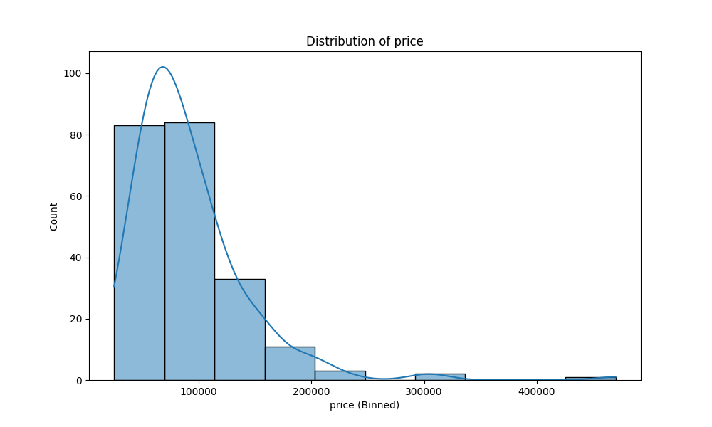
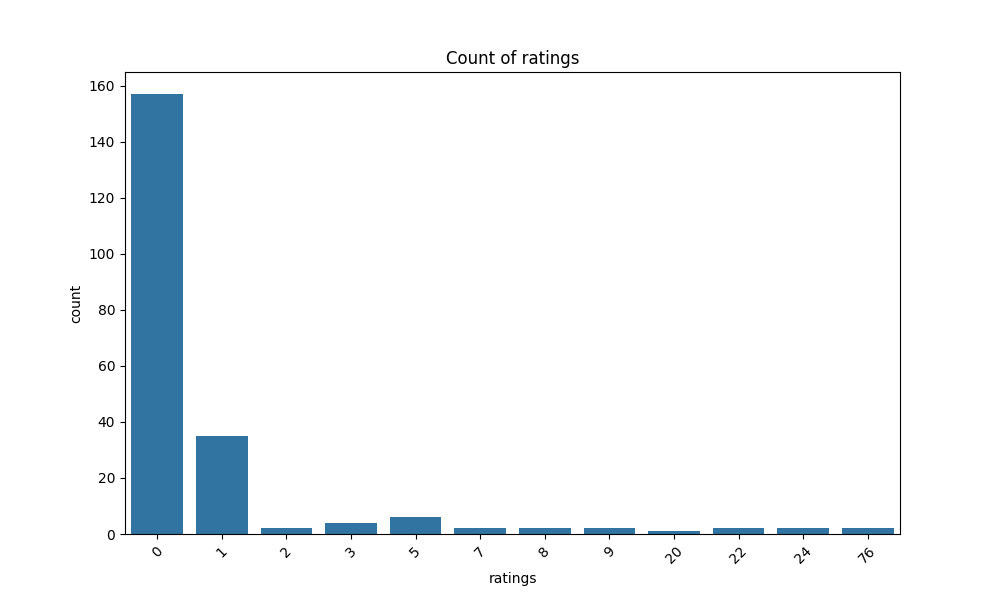
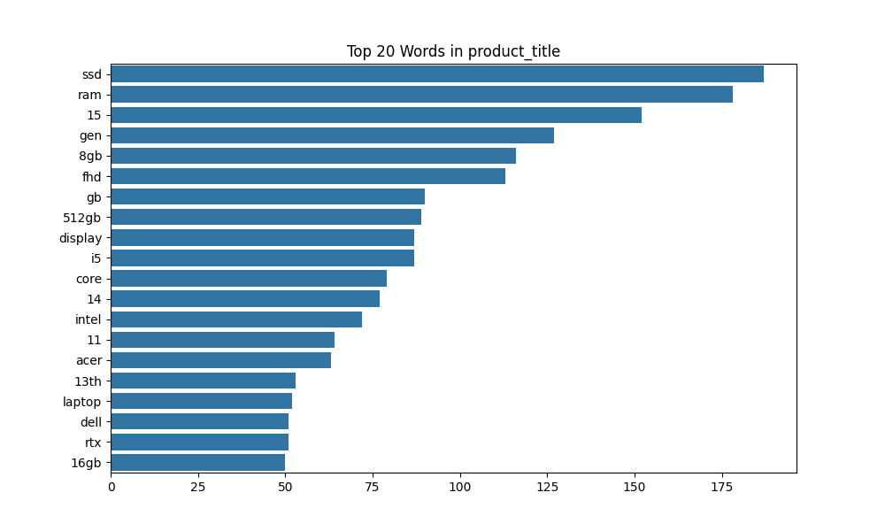
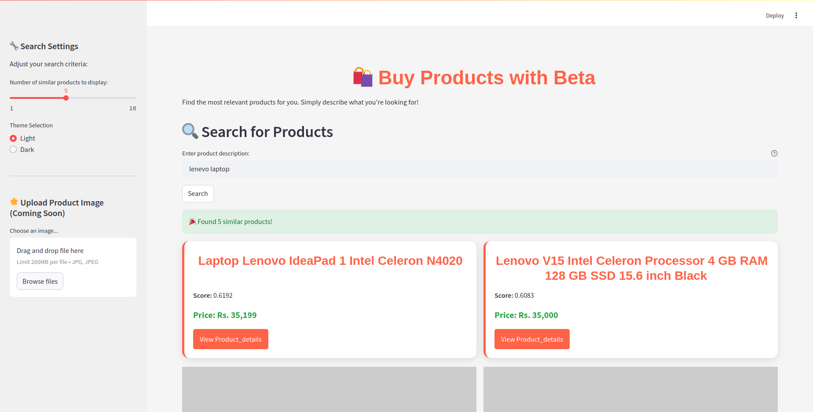

# semantic_search_engine
- [semantic\_search\_engine](#semantic_search_engine)
  - [Overview](#overview)
  - [Key features:](#key-features)
  - [Project Structure](#project-structure)
  - [Getting started:](#getting-started)
    - [Prerequisites:](#prerequisites)
    - [Installation](#installation)
    - [|Running the Application](#running-the-application)
- [dropped all the null valued data](#dropped-all-the-null-valued-data)
  - [Screenshot of UI:](#screenshot-of-ui)
  - [References:](#references)

## Overview
This project implements a Semantic Search Engine that goes beyond traditional keyword matching by understanding the meaning of search queries using Natural Language Processing (NLP). It leverages advanced machine learning models to encode text into vector embeddings, enabling more accurate and relevant search results based on semantic similarity. The search engine is built using Elasticsearch and a Transformer-based model like Sentence-BERT.
## Key features:
- **Semantic Understanding**: instead of matching exact words, the engine interprets the meaning behind the query, improving search relevance.
- **Vector Search:** Text documents and search queries are encoded into high-dimensional vectors, allowing similarity-based retrieval using K-Nearest Neighbors (KNN) search.
- **Efficient Search with Elasticsearch:** The project integrates with Elasticsearch, a scalable search engine that supports vector indexing and querying.
- **Text Encoding:** Utilizes SentenceTransformer models to convert product descriptions or documents into vector embeddings.
-**KNN Search:** Enables finding the most semantically similar items by comparing the encoded query to indexed vectors.

## Project Structure
semantic_search_engine/  
├── Data  
    ├── cleaned_file.csv  
    ├── product_data.csv  
│   └── myntra_products_catalog.csv    
├── index  
│   └── indexmapping.py  
├── index.ipynb  
├── app.py  
├── project_structure.txt  
├── README.md  
├── src  
│   ├── data_index.py    
│   └── main.py  
└── utils  
│    └── preprocess.py   

## Getting started:
### Prerequisites:
1. Python 3.9+
2. Elasticsearch (Version 8.x recommended)
3. Virtual Environment (Optional, but recommended)
### Installation
1. Clone the repository:
    ```
    git clone https://github.com/swostika-048/semantic_search_engine.git
    cd semantic_search_engine

    ```
2. Create and activate a virtual environment (optional):
    ``` 
    python3 -m venv venv
    On linux:source venv/bin/activate  
    On Windows: venv\Scripts\activate

    ```
3. Install the dependencies:
   ``` 
   pip install -r requirements.txt
    ```
4. Setup environment variables in the .env file:
   ``` 
    ELASTICSEARCH_HOST=hostname      
    ELASTICSEARCH_PORT=portnumber
    ELASTICSEARCH_USER=username
    ELASTICSEARCH_PASSWORD=password

    # change hostname, portnumber,username,password with the elatiscsearch server hostname portnumber username and password
    ```
### |Running the Application
1. Start Elasticsearch: Ensure that Elasticsearch server is running.
      ```
      sudo systemctl start elasticsearch
      OR
      python elastic_serarch/start_es.py
   ```
2. run app.py
   ```
   streamlit run app.py
   ```

## Data Visualization
- Checking null values:
  ```
  Number of missing values per column:
  link               0
  product_title      0
  price              1
  actual_price     317
  ratings            0
  color              0
  dtype: int64

  # dropped all the null valued data
  
  ```

- Summary Statistics"
  ```
  Summary statistics for numeric columns:
              price actual_price
  count          533          217
  unique         340          119
  top     Rs. 65,000   Rs. 85,000
  freq            10            8
  ```
- Data visualization of price distribution chart:
  

- Data visualization of Count of ratings:
  

- Word Frequency plot of first 20 words:
- 
  
## Screenshot of UI:
- 


## References:
- [https://www.elastic.co/what-is/semantic-search](https://www.elastic.co/what-is/semantic-search)
- [https://www.youtube.com/watch?v=KSwPR9eig7w&t=569s](https://www.youtube.com/watch?v=KSwPR9eig7w&t=569s)
- [https://www.kaggle.com/datasets/shivamb/fashion-clothing-products-catalog](https://www.kaggle.com/datasets/shivamb/fashion-clothing-products-catalog)